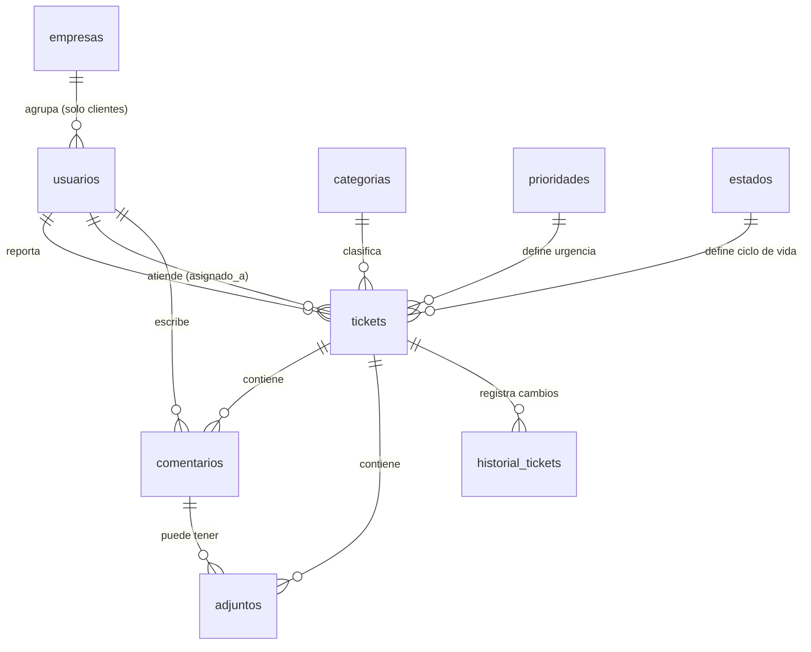

# Planeación — Sistema de Tickets

Documento de planeación inicial para el sistema de tickets de soporte del software en desarrollo. En esta primera etapa solo se define el **modelo de datos (tablas)** y una breve explicación de qué manejará cada una.

---

## Visión general

El sistema permitirá que los usuarios reporten incidencias o solicitudes (tickets), que un equipo de soporte las atienda, y que quede registro de toda la conversación y los cambios de estado de cada ticket.

Módulos que cubren estas tablas:

1. **Empresas, usuarios y roles** — qué empresa cliente reporta, quién usa el sistema y qué permisos tiene.
2. **Tickets** — el núcleo: incidencias/solicitudes con su categoría, prioridad y estado.
3. **Seguimiento** — comentarios, archivos adjuntos e historial de cambios.

**Regla de negocio clave:** no hay auto-registro. Solo un **admin** o **agente** puede crear usuarios, y todo usuario `cliente` queda asociado a una **empresa**. Cualquier usuario de esa empresa puede ver y dar seguimiento a los tickets de sus compañeros (no solo a los que él mismo creó).

---

## Infraestructura de autenticación y API

La API será **PostgREST** sobre **PostgreSQL**, y la autenticación se delega a **AWS Cognito**:

- **Cognito (User Pool)** administra las cuentas: registro, login, contraseñas, MFA y recuperación. **La base de datos NO almacena contraseñas.**
- Los **roles se manejan como Grupos de Cognito** (ej. `admin`, `agente`, `cliente`). El grupo viaja en el JWT (claim `cognito:groups`).
- **PostgREST valida el JWT** de Cognito (vía JWKS del User Pool) y mapea el claim de rol a un **rol de PostgreSQL** (`SET ROLE`).
- La autorización fina se implementa con **RLS (Row Level Security)** en PostgreSQL: por ejemplo, un `cliente` solo ve sus propios tickets; un `agente` ve los asignados o de su área.
- El vínculo entre Cognito y la BD es el **`sub`** del token (UUID único del usuario en Cognito), guardado en `usuarios.cognito_sub`. Dentro de las políticas RLS se lee con `current_setting('request.jwt.claims')`.

Flujo resumido:

```
Frontend → login en Cognito → recibe JWT
Frontend → llama a PostgREST con Authorization: Bearer <JWT>
PostgREST → valida JWT → SET ROLE según grupo → consulta con RLS aplicada
```

---

## Tablas

### 1. Roles — *no es una tabla propia*

Los roles **no se guardan en una tabla de la aplicación**: son **Grupos de Cognito** (`admin`, `agente`, `cliente`) que llegan en el JWT, y en PostgreSQL existen como **roles de base de datos** que PostgREST asume con `SET ROLE`. Los permisos se definen con `GRANT` y políticas **RLS** sobre las tablas.

Se guarda una copia del rol en `usuarios.rol` solo como referencia para la interfaz (mostrar quién es agente, filtrar asignables, etc.), pero la fuente de verdad de permisos es siempre el JWT de Cognito.

---

### 2. `empresas`

Empresas cliente. Cada usuario con rol `cliente` pertenece a una; el personal interno (`admin`/`agente`) no pertenece a ninguna.

| Campo       | Tipo         | Descripción                          |
|-------------|--------------|---------------------------------------|
| id          | INT PK AI    | Identificador de la empresa          |
| nombre      | VARCHAR(150) | Nombre de la empresa (único)         |
| descripcion | VARCHAR(255) | Descripción breve                    |
| activa      | BOOLEAN      | Permite desactivar clientes sin borrar su historial |
| creado_en   | TIMESTAMPTZ  | Fecha de alta                        |

---

### 3. `usuarios`

Perfil local de las personas que interactúan con el sistema. Es un **espejo mínimo de Cognito**, pero a diferencia de un modelo de auto-registro, **no se crea solo**: únicamente `admin` o `agente` pueden dar de alta un usuario (primero se crea la cuenta en Cognito con `AdminCreateUser`, luego esta fila). Sin contraseñas — eso vive en Cognito.

| Campo       | Tipo         | Descripción                                                  |
|-------------|--------------|--------------------------------------------------------------|
| id          | INT PK AI    | Identificador interno del usuario                            |
| cognito_sub | UUID UNIQUE  | `sub` del token de Cognito — vínculo con el User Pool        |
| nombre      | VARCHAR(100) | Nombre completo (sincronizado desde Cognito)                 |
| email       | VARCHAR(150) | Correo (sincronizado desde Cognito)                          |
| celular     | VARCHAR(20)  | Numer de celular                                             |
| rol         | VARCHAR(30)  | Copia informativa del grupo de Cognito (admin/agente/cliente)|
| empresa_id  | INT FK NULL  | Empresa a la que pertenece (`empresas.id`); obligatorio si `rol = 'cliente'`, NULL para admin/agente |
| activo      | BOOLEAN      | Si la cuenta está habilitada en la aplicación                |
| creado_en   | TIMESTAMPTZ  | Fecha de registro                                            |

**Quién puede crear usuarios:**
- `admin` — puede crear cualquier usuario (admin, agente o cliente).
- `agente` — solo puede crear usuarios `cliente`, y debe asignarles una `empresa_id`.
- `cliente` — no puede crear usuarios (ni a sí mismo ni a nadie más).

---

### 4. `categorias`

Clasifica los tickets por área o tipo de problema (ej. Error del sistema, Solicitud de función, Facturación, Soporte técnico).

| Campo       | Tipo         | Descripción                          |
|-------------|--------------|--------------------------------------|
| id          | INT PK AI    | Identificador de la categoría        |
| nombre      | VARCHAR(80)  | Nombre de la categoría               |
| descripcion | VARCHAR(255) | Descripción breve                    |
| activa      | BOOLEAN      | Permite ocultar categorías en desuso |

---

### 5. `prioridades`

Nivel de urgencia del ticket (ej. Baja, Media, Alta, Crítica). Se maneja como tabla para poder agregar niveles sin tocar código.

| Campo  | Tipo        | Descripción                                      |
|--------|-------------|--------------------------------------------------|
| id     | INT PK AI   | Identificador de la prioridad                    |
| nombre | VARCHAR(30) | Nombre del nivel                                 |
| nivel  | INT         | Valor numérico para ordenar (1 = más urgente)    |

---

### 6. `estados`

Ciclo de vida del ticket (ej. Abierto, En progreso, En espera del usuario, Resuelto, Cerrado).

| Campo    | Tipo        | Descripción                                        |
|----------|-------------|----------------------------------------------------|
| id       | INT PK AI   | Identificador del estado                           |
| nombre   | VARCHAR(40) | Nombre del estado                                  |
| es_final | BOOLEAN     | Marca estados terminales (Resuelto/Cerrado)        |

---

### 7. `tickets`

Tabla principal del sistema. Cada fila es una incidencia o solicitud reportada. Un usuario `cliente` ve **todos los tickets de su empresa**, no solo los que él creó — así cualquier compañero puede dar seguimiento.

| Campo          | Tipo         | Descripción                                            |
|----------------|--------------|--------------------------------------------------------|
| id             | INT PK AI    | Identificador del ticket (folio)                       |
| titulo         | VARCHAR(150) | Resumen corto del problema                             |
| descripcion    | TEXT         | Detalle completo del problema o solicitud              |
| usuario_id     | INT FK       | Quién reportó el ticket (`usuarios.id`)                |
| asignado_a     | INT FK NULL  | Agente responsable (`usuarios.id`), null si sin asignar|
| categoria_id   | INT FK       | Referencia a `categorias.id`                           |
| prioridad_id   | INT FK       | Referencia a `prioridades.id`                          |
| estado_id      | INT FK       | Referencia a `estados.id`                              |
| creado_en      | DATETIME     | Fecha de creación                                      |
| actualizado_en | DATETIME     | Última modificación                                    |
| cerrado_en     | DATETIME NULL| Fecha de cierre (null mientras siga abierto)           |

---

### 8. `comentarios`

Conversación dentro de cada ticket: respuestas del agente, aclaraciones del usuario y notas internas del equipo.

| Campo      | Tipo      | Descripción                                              |
|------------|-----------|----------------------------------------------------------|
| id         | INT PK AI | Identificador del comentario                             |
| ticket_id  | INT FK    | Ticket al que pertenece (`tickets.id`)                   |
| usuario_id | INT FK    | Autor del comentario (`usuarios.id`)                     |
| contenido  | TEXT      | Texto del comentario                                     |
| es_interno | BOOLEAN   | Si es nota interna (visible solo para agentes/admins)    |
| creado_en  | DATETIME  | Fecha del comentario                                     |

---

### 9. `adjuntos`

Archivos que acompañan al ticket o a un comentario (capturas de pantalla, logs, documentos).

| Campo         | Tipo         | Descripción                                          |
|---------------|--------------|------------------------------------------------------|
| id            | INT PK AI    | Identificador del adjunto                            |
| ticket_id     | INT FK       | Ticket al que pertenece (`tickets.id`)               |
| comentario_id | INT FK NULL  | Comentario asociado, si aplica (`comentarios.id`)    |
| nombre_archivo| VARCHAR(255) | Nombre original del archivo                          |
| ruta          | VARCHAR(500) | Ruta o URL de almacenamiento                         |
| tipo_mime     | VARCHAR(100) | Tipo de archivo (image/png, application/pdf, etc.)   |
| tamano_bytes  | BIGINT       | Tamaño del archivo                                   |
| subido_en     | DATETIME     | Fecha de subida                                      |

---

### 10. `historial_tickets`

Auditoría: registra cada cambio relevante de un ticket (cambio de estado, reasignación, cambio de prioridad). Permite reconstruir qué pasó y cuándo.

| Campo          | Tipo         | Descripción                                        |
|----------------|--------------|----------------------------------------------------|
| id             | INT PK AI    | Identificador del registro                         |
| ticket_id      | INT FK       | Ticket afectado (`tickets.id`)                     |
| usuario_id     | INT FK       | Quién hizo el cambio (`usuarios.id`)               |
| campo          | VARCHAR(50)  | Campo modificado (estado, prioridad, asignado_a…)  |
| valor_anterior | VARCHAR(255) | Valor antes del cambio                             |
| valor_nuevo    | VARCHAR(255) | Valor después del cambio                           |
| fecha          | DATETIME     | Cuándo ocurrió el cambio                           |

---

## Relaciones (resumen)



---

## Notas / pendientes para siguientes etapas

- Motor de base de datos: **PostgreSQL** (requerido por PostgREST). Usar `TIMESTAMPTZ` para todas las fechas.
- Definir los **grupos en Cognito** (`admin`, `agente`, `cliente`) y crear los roles equivalentes en PostgreSQL con sus `GRANT`.
- Escribir las **políticas RLS** por tabla (ej. `cliente` solo ve tickets donde `usuario_id` = su usuario; `agente` ve los asignados; `admin` ve todo).
- Construir la pantalla de administración para que admin/agente den de alta usuarios: primero crea la cuenta en Cognito (`AdminCreateUser` + `AdminAddUserToGroup`) y luego el espejo en `usuarios` con su `empresa_id`. Como el navegador no puede llamar `AdminCreateUser` directamente (requiere credenciales de servidor), esto necesita una función/endpoint intermedio (ej. Lambda) — no se puede hacer solo con PostgREST.
- Quitar del frontend el flujo público de "Crear cuenta" (ya no aplica: no hay auto-registro, y a nivel de base de datos `cliente` ya no tiene permiso de `INSERT` en `usuarios`).
- Decidir si se necesita **SLA** (tiempos máximos de respuesta/resolución) — implicaría una tabla adicional.
- Notificaciones (correo o dentro de la app) cuando cambia el estado de un ticket — Cognito no cubre esto; evaluar SES/SNS.
- Definir los endpoints que expone PostgREST (vistas/funciones para operaciones que no sean CRUD directo, ej. asignar ticket, cerrar ticket).
